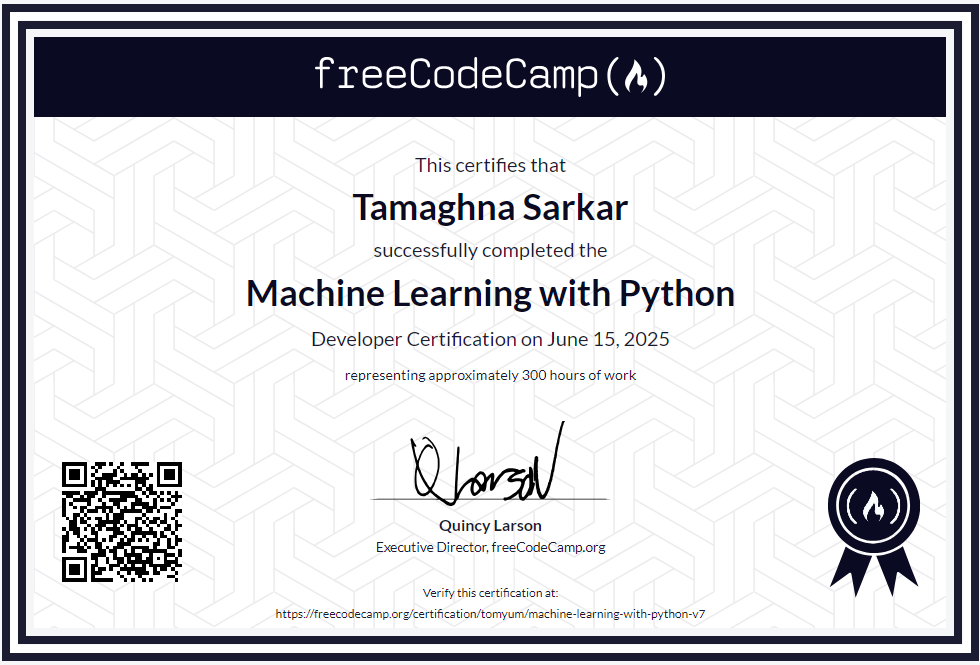

# Machine-Learning-Freecodecamp
All projects completed as part of freeCodeCamp’s Machine Learning with Python certification course. I had fun while learning on freecodecamp personally ,it is  genuinely a great platform to learn by doing . i have enlisted 4 projects which includes 
1. cat dog classifier model
2. book recommendation model
3. SMS text classifier
4. Linear Regression health costs calculator

I worked on these projects on google colab notebook (cloud based version of jupyter notebook) .
the libraries that i have used are ,
Pandas – for data analysis and manipulation

NumPy – for numerical operations

Matplotlib – for data visualization

Seaborn – for statistical plotting (used in some visualizations)

Scikit-learn (sklearn) – for machine learning algorithms like KNN, train-test split, and model evaluation
## 🏆 Certificate

